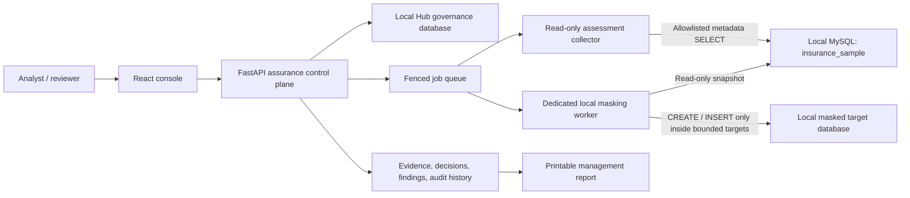

# AegisDB Security Assurance Hub

AegisDB is an evidence-based database security assurance platform. It collects
approved read-only metadata, guides human control reviews, records immutable
evidence and findings, creates bounded masked copies for local development, and
produces a printable management report.

> [!IMPORTANT]
> The supported local workflow uses only the loopback MySQL database
> `insurance_sample`. It never reads, connects to, or changes Azure SQL.
> `insurance_sample` remains read-only. Masking writes are allowed only in a
> separate, server-derived target named `insurance_sample_masked_<workflow>`.

## Contents

- [Project goals](#project-goals)
- [Delivered capabilities](#delivered-capabilities)
- [System architecture](#system-architecture)
- [Security boundaries](#security-boundaries)
- [Technology stack](#technology-stack)
- [Prerequisites](#prerequisites)
- [Installation](#installation)
- [Configuration](#configuration)
- [Running the project](#running-the-project)
- [Complete local MySQL workflow](#complete-local-mysql-workflow)
- [Management report](#management-report)
- [Console pages](#console-pages)
- [Testing](#testing)
- [Troubleshooting](#troubleshooting)
- [Repository structure](#repository-structure)
- [Production limitations](#production-limitations)
- [Documentation](#documentation)

## Project goals

The project provides a clear separation between automated collection and human
security decisions:

1. Collect bounded database metadata using allowlisted `SELECT` queries.
2. Preserve evidence lineage and SHA-256 digests.
3. Require an analyst to decide whether each control passes, fails, or is not
   applicable.
4. Calculate a transparent score only after every required decision is saved.
5. Track findings, remediation ownership, status, due dates, and audit reasons.
6. Discover potentially sensitive columns without exposing application values
   in the browser or control plane.
7. Create isolated, development-only masked MySQL copies without changing the
   source.
8. Retain completed workflow evidence and generate management-ready reports.

## Delivered capabilities

| Capability | Current behavior |
|---|---|
| Security overview | Shows the latest completed assurance score, assets, findings, domain posture, activity, and next recommended action |
| Database assets | Displays the registered database inventory, ownership, environment, scan status, and health |
| Assessments | Queues allowlisted collection jobs, records immutable evidence, supports control-by-control analyst decisions, and finalizes a server-calculated score |
| Sensitive-data discovery | Classifies columns from schema names and data types; raw application values are not displayed or retained by the Hub |
| Access security | Verifies the local collector account and its effective schema privileges |
| Data masking | Runs a four-step governed workflow: draft, approve, create isolated copy, and human validation |
| Findings | Tracks control failures with severity, owner, due date, workflow state, remediation guidance, and audit reason |
| Evidence library | Displays timestamped evidence identifiers, source, platform, digest state, and retention classification |
| Management report | Provides a printable executive summary at `/console/report` with **Print / Save PDF** |
| Repeatable workflows | Creates a new target database for each later masking workflow without overwriting earlier results |
| Archiving | Hides a completed masking workflow from the default list while retaining its target database and evidence |
| Error handling | Presents friendly messages for conflicts, expired sessions, unavailable services, and invalid API responses |
| Platform support | Includes versioned control packs and collector adapters for Oracle, PostgreSQL, SAP Sybase ASE, and MySQL; the bounded runnable local workflow is MySQL |

## System architecture



The normal assessment collector and the masking worker are separate identities:

- `assurance_hub_ro` receives only `SELECT` and `SHOW VIEW` on
  `insurance_sample`.
- `assurance_hub_mask_writer` has bounded authority for worker-owned staging
  and generated masked targets, never the source.
- `insurance_masked_test_ro` receives only `SELECT` and `SHOW VIEW` on final
  generated masked targets for application-utility validation.

The dedicated masking connector is an internal worker connector. It is
deliberately excluded from the assessment-target dropdown.

## Security boundaries

### Local MySQL source

- Host must be exactly `127.0.0.1` or `localhost`.
- Source database must be exactly `insurance_sample`.
- The assessment identity has only `SELECT` and `SHOW VIEW`.
- Assessment queries are allowlisted and run in a read-only transaction.
- The masking worker reads a consistent, read-only snapshot.
- The source is checked before and after masking to detect changes.

### Local masked copy

- The browser cannot submit a host, database name, SQL statement, credential,
  or row cap.
- The API derives a unique target such as
  `insurance_sample_masked_<workflow>`.
- No more than 500 rows per table is processed.
- Selected sensitive values are transformed before any target insert.
- Non-sensitive keys and structural fields may be retained when required to
  preserve relationships and application utility.
- Raw rows and values never enter the Hub API, evidence, logs, or browser.
- Internal work is isolated in `aegisdb_mask_stage_<workflow>`.
- Drop stale staging tables only when they match the exact worker-owned manifest.
- One atomic rename publishes the completed set of masked tables.
- The dedicated worker never runs `DROP`, `UPDATE`, `DELETE`, or overwrite operations on the source or
  final database.
- Row counts, manifests, digests, masked-value counts, and foreign keys are
  checked before success evidence is accepted.
- Existing final targets are never overwritten, truncated, updated, or
  deleted.
- A later workflow receives a separate target and preserves earlier targets.
- Each new workflow gets a different empty final database.
- An interrupted completion may recover only its own target.
- A changed source, mismatched target, or ambiguous final/staging state fails closed.
- Internal staging is worker-controlled and is never available to the
  read-only application test account.

### Evidence and governance

- Raw database rows and values never enter the Hub API, browser, logs, or
  evidence records.
- Automated collection is evidence, not an automatic pass or score.
- Automated copy checks never mark a control passed and never assign a score.
- Analyst decisions require an outcome and rationale.
- Final scores are calculated by the API, not submitted by the browser.
- Completed decisions and evidence are retained for audit.
- Archiving changes only Hub governance metadata; it does not delete MySQL
  databases or evidence.

### Azure SQL exclusion

Local MySQL mode parses only these six keys:

```text
MYSQL_TARGET_HOST
MYSQL_TARGET_PORT
MYSQL_TARGET_DATABASE
MYSQL_TARGET_USERNAME
MYSQL_TARGET_PASSWORD
MYSQL_TARGET_CHARSET
```

Every other entry in the environment file, including every Azure SQL setting,
is ignored. The local launcher contains no Azure SQL connection step, and the
local masking worker never connects to or changes Azure SQL.

## Technology stack

| Layer | Technology |
|---|---|
| Web console | React 19, TypeScript, vinext/Vite, Lucide icons |
| API | Python 3.12, FastAPI, Pydantic, SQLAlchemy, Alembic |
| Local control-plane storage | SQLite through `aiosqlite` |
| Production persistence contract | PostgreSQL with tenant isolation and row-level-security migrations |
| Collectors | Python, fenced leases, allowlisted platform adapters |
| Local database proof | Oracle MySQL 8.0.13 or newer |
| Observability | Structured JSON logs, health/readiness, Prometheus metrics, optional OpenTelemetry |
| Infrastructure contracts | Docker Compose harness, Kubernetes manifests, Prometheus rules |

## Prerequisites

The local workflow is designed and tested for Windows PowerShell.

- Node.js `>=22.13.0`
- npm
- Python 3.12
- Oracle MySQL `>=8.0.13` running on loopback
- An existing local `insurance_sample` database
- A local MySQL administrative account for one-time least-privilege bootstrap
- MySQL Workbench is optional but useful for inspecting generated targets

Check the installed versions:

```powershell
node --version
npm --version
py -3.12 --version
```

## Installation

From the repository root:

```powershell
cd "C:\Users\subhranilroy\Downloads\Database Security Assurance Hub"
npm ci

py -3.12 -m venv services/api/.venv
services/api/.venv/Scripts/python.exe -m pip install --upgrade pip
services/api/.venv/Scripts/python.exe -m pip install -e "services/api[dev,sqlite,observability]"
services/api/.venv/Scripts/python.exe -m pip install -e "services/collector[mysql]"
```

The Python virtual environment is stored inside `services/api/.venv` and is
ignored by Git.

## Configuration

By default, `npm run dev:mysql` reads:

```text
C:\Users\subhranilroy\Downloads\Database\.env
```

Create that file with local MySQL values only:

```dotenv
MYSQL_TARGET_HOST=127.0.0.1
MYSQL_TARGET_PORT=3306
MYSQL_TARGET_DATABASE=insurance_sample
MYSQL_TARGET_USERNAME=<local-mysql-administrator>
MYSQL_TARGET_PASSWORD=<local-mysql-password>
MYSQL_TARGET_CHARSET=utf8mb4
```

`MYSQL_TARGET_DATABASE` must remain `insurance_sample` and the host must remain
loopback. `utf8mb4` is required so masked data supports the full Unicode range.

To use another secure local file without editing the launcher:

```powershell
$env:ASSURANCE_LOCAL_MYSQL_ENV_FILE="C:\secure-local-path\mysql.env"
npm run dev:mysql
```

Do not commit credentials. `.env*`, `.local-secrets/`, virtual environments,
local databases, logs, and build outputs are already excluded by `.gitignore`.

## Running the project

### 1. Visual fixture preview

```powershell
npm run dev
```

Use this mode for UI and route review. It displays explicitly labelled fixture
data and does not provide the persistent local MySQL workflow.

### 2. Integrated synthetic workflow

```powershell
npm run dev:integrated
```

This mode starts the console, local API, local SQLite governance database, and
synthetic metadata collector. It exercises the real queue and evidence
contracts but does not query a customer database.

### 3. Local MySQL assessment and masking workflow

```powershell
npm run dev:mysql
```

This is the main end-to-end local workflow. It:

1. applies the Hub database migrations;
2. starts the API on `127.0.0.1:8000`;
3. verifies the local MySQL boundary;
4. creates or verifies least-privilege local accounts;
5. registers the `insurance_sample` asset and collectors;
6. starts the read-only assessment collector;
7. starts the dedicated local masking worker;
8. starts the console at `http://localhost:3000`.

Keep the PowerShell window open while using the application. Stop the entire
local stack with `Ctrl+C`.

> [!WARNING]
> Run only one local stack at a time. Starting it twice causes Windows error
> `10048` because port 8000 is already occupied.

## Complete local MySQL workflow

### Step 1: Verify the asset

Open `http://localhost:3000/console/assets`.

Expected result:

- one local MySQL asset named `insurance_sample`;
- healthy local collector state;
- no credential form in the browser.

### Step 2: Queue an assessment

1. Open **Assessments**.
2. Select the visible `insurance_sample` read-only collector target.
3. Click **Queue assessment**.
4. Wait until automatic collection is complete and the assessment is awaiting
   review.

The internal masking connector must not appear in this dropdown.

### Step 3: Review automatic metadata

Use **Review controls** to inspect:

- collector-account context and privileges;
- table/object inventory;
- transport-security metadata;
- the manual masking-governance control.

Do not select outcomes randomly:

- **Pass** only when the evidence and approved policy support the control.
- **Fail** when evidence contradicts the requirement or required proof is
  missing.
- **Not applicable** only when an approved policy excludes the control.

Every saved decision requires a clear rationale. Automated evidence never
chooses an outcome for the analyst.

### Step 4: Discover sensitive columns

Open **Data discovery**. The page classifies schema columns as restricted,
confidential, or internal using metadata such as column names and data types.
It does not display representative row values and does not prove that a column
is already protected.

### Step 5: Verify access security

Open **Access security**. Confirm that the service account is the intended local
collector identity and that its effective source grants are limited to
`SELECT` and `SHOW VIEW`. Saving an analyst decision updates only the Hub review
record; it never grants or revokes MySQL privileges.

### Step 6: Run the masking workflow

Open **Data masking** and complete the four displayed stages.

#### 6.1 Create draft

Example values:

```text
Plan name: Customer identifiers
Classification: Restricted and confidential
Technique: Substitute
Target environment: Development
```

Click **Create draft**. This creates only a Hub governance record.

#### 6.2 Approve plan

Example review note:

```text
Approved for a controlled local development masking test.
```

Click **Approve plan**.

#### 6.3 Create masked copy

Click **Create masked copy** and wait for **Execution recorded**. The dedicated
worker creates the server-derived target, masks selected values, verifies the
source is unchanged, checks counts and foreign keys, and submits aggregate
evidence.

The first seeded workflow may use `insurance_sample_masked`. Later independent
workflows use unique targets such as
`insurance_sample_masked_a9df6eae780a`.

#### 6.4 Validate evidence

Use the generated `insurance_masked_test_ro` account to inspect the target with
read-only access. Confirm expected tables, row counts, formats, relationships,
queries, and application behavior.

Example validation note:

```text
Verified using the read-only test account. Expected tables and row counts were confirmed, masked values were reviewed, and integrity checks passed.
```

Click **Validate evidence** only after completing those checks. Validation
records the human conclusion; it does not run masking again.

### Step 7: Finalize the assessment

Return to **Assessments**, review all four controls, save each decision and
rationale, and then click **Finalize assessment**.

The API calculates:

```text
score = passed / (passed + failed) * 100
```

Controls marked **Not applicable** are excluded from the denominator. A score
describes the recorded assessment decisions; it is not proof that the software
or database is universally secure.

### Step 8: Manage findings

A failed decision creates or reopens a finding. Open **Findings** to assign an
owner, due date, workflow state, and audit reason. Marking a finding resolved
updates its Hub governance lifecycle; it does not remediate or alter MySQL.

### Step 9: Start another workflow

Click **Start another workflow** on the masking page, or create another draft.
The API derives a different target database. Earlier targets and evidence are
not overwritten.

### Step 10: Archive a completed workflow

For a validated workflow, enter an archive reason such as:

```text
Workflow completed, evidence validated, and retained for audit.
```

Click **Archive workflow**. Use **Show archived** to view archived records.
Archiving does not delete evidence or the local masked target.

## Management report

Open:

```text
http://localhost:3000/console/report
```

The report summarizes the visible assets, completed assessments, score
interpretation, findings, evidence, masking outcomes, and local safety boundary.

To create a shareable PDF:

1. click **Print / Save PDF**;
2. choose **Save as PDF** or **Microsoft Print to PDF**;
3. choose the destination and save the file.

The report is a governed summary of recorded evidence and decisions, not a
production security certification.

## Console pages

| Route | Purpose |
|---|---|
| `/console` | Overall posture, score trend, activity, platform coverage, and next action |
| `/console/assets` | Managed database inventory |
| `/console/assessments` | Assessment queue, collection status, history, and scores |
| `/console/assessments/<id>` | Evidence review, analyst decisions, and finalization |
| `/console/findings` | Remediation workflow and accountable ownership |
| `/console/data-discovery` | Metadata-first sensitive-column classification |
| `/console/access` | Local collector account verification and analyst record |
| `/console/masking` | Repeatable four-stage local masking workflow |
| `/console/evidence` | Evidence lineage, digests, timestamps, and retention |
| `/console/report` | Printable management report |
| `/console/admin/connectors` | Collector registration and health |

## Testing

### Web application

```powershell
npm run lint
npm test
```

`npm test` builds the web application and runs rendered-route, architecture,
and safe-image tests.

### API

```powershell
services/api/.venv/Scripts/python.exe -m ruff check services/api
services/api/.venv/Scripts/python.exe -m mypy services/api/assurance_hub
services/api/.venv/Scripts/python.exe -m pytest services/api/tests -q
```

### Collector and masking engine

```powershell
services/api/.venv/Scripts/python.exe -m ruff check services/collector
services/api/.venv/Scripts/python.exe -m mypy services/collector/assurance_collector
services/api/.venv/Scripts/python.exe -m pytest services/collector/tests -q
```

### Control packs and infrastructure contracts

```powershell
services/api/.venv/Scripts/python.exe tools/validate_control_packs.py
services/api/.venv/Scripts/python.exe tools/validate_infrastructure.py --source-dir infra/kubernetes/base --profile base
services/api/.venv/Scripts/python.exe tools/validate_observability.py
```

These automated tests use controlled fixtures or ephemeral local test storage.
They are not permission to run against Azure SQL or another external database.

## Troubleshooting

### Port 8000 is already in use

Typical error:

```text
[Errno 10048] ... bind on address ('127.0.0.1', 8000)
```

Another local API is already running. Return to its PowerShell window and press
`Ctrl+C`. Start `npm run dev:mysql` once.

To identify the process when the original terminal is unavailable:

```powershell
Get-NetTCPConnection -LocalPort 8000 -State Listen |
  Select-Object LocalAddress, LocalPort, OwningProcess
```

Inspect the process before deciding whether to stop it:

```powershell
Get-Process -Id <OwningProcess>
```

### The browser shows an old interface

Stop the running stack with `Ctrl+C`, start it again once, then perform a hard
refresh with `Ctrl+F5`.

### A masking copy is waiting

Keep the launcher terminal open and use **Refresh status**. Verify that the
dedicated masker and API have not exited. Do not create a replacement target
manually; the API owns target naming.

### A new assessment was not queued

Only one active assessment for the same asset and control-pack version may
progress at a time. Finish the pending review and finalization first, then queue
the next run. Conflict messages are intentionally fail-closed.

### Pass is unavailable for the masking control

The control cannot pass without valid masking evidence. Complete the masking
workflow, validate its evidence, and then start or review the assessment that
contains the relevant evidence. Missing proof can only fail or remain not
applicable under an approved exclusion.

### Local MySQL bootstrap fails

Confirm:

- MySQL is running on `127.0.0.1` or `localhost`;
- the configured port is correct;
- `insurance_sample` exists;
- the configured bootstrap account can create the three fixed local service
  users and generated target databases;
- the database is Oracle MySQL 8.0.13 or newer, not MariaDB;
- the charset is `utf8mb4`.

Never solve a local failure by substituting an Azure SQL host.

## Repository structure

| Path | Purpose |
|---|---|
| `app/` | Console pages and server-side action routes |
| `components/` | React views, navigation, report, forms, and shared UI components |
| `services/api/` | FastAPI control plane, models, migrations, governance logic, and tests |
| `services/collector/` | Read-only collectors, MySQL masking worker, adapters, and tests |
| `control-packs/` | Immutable versioned database control definitions |
| `scripts/` | Local launchers and bounded development orchestration |
| `tools/` | MySQL bootstrap and repository validation tools |
| `docs/` | Architecture, environment, threat model, runbook, SLOs, and acceptance gates |
| `infra/` | Docker Compose integration harness, Kubernetes contracts, and Prometheus rules |
| `tests/` | Web rendering, architecture, and asset-safety tests |
| `worker/` | Private Sites worker entry and response-security behavior |

## Production limitations

This repository demonstrates implemented controls, not customer production
approval. Do not describe it as production-certified until the required
environment evidence is complete.

Production promotion requires, at minimum:

- enterprise identity-provider and token-broker integration;
- managed PostgreSQL tenant-isolation validation;
- approved vault/KMS, PKI, TLS, and credential-rotation integration;
- approved database drivers and source/version certification;
- customer-specific grants and network allowlists;
- negative-write tests against every source platform;
- load, soak, penetration, restore, failover, and rotation testing;
- a separately approved non-production masking pilot;
- signed images, SBOM retention, alert delivery, and owner sign-off.

The local MySQL masking worker is deliberately excluded from production
Compose and Kubernetes workloads. It is a bounded development proof, not a
general production masking service.

## Documentation

- [Architecture](docs/architecture.md)
- [Environment and secret contract](docs/environment.md)
- [Implementation status](docs/implementation-status.md)
- [Threat model](docs/threat-model.md)
- [Operational runbook](docs/runbook.md)
- [SLO and reliability](docs/slo-and-reliability.md)
- [Deployment and supply chain](docs/deployment-and-supply-chain.md)
- [Phased acceptance checklist](docs/phased-acceptance-checklist.md)

---

**Project summary:** AegisDB turns bounded database metadata into traceable
evidence, accountable human decisions, repeatable local masking workflows, and
management-ready reporting while preserving a strict read-only source boundary.
